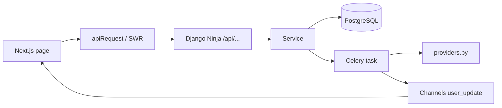

# Bookar — Guia para Agentes de IA

Plataforma de aprendizagem com IA (cursos gerados, mapas mentais, explicador por voz e caderno de notas). Monorepo com **frontend** (Next.js) e **backend** (Django), orquestrados via **Docker Compose** em desenvolvimento.

## Estrutura do repositório

```
Bookar/
├── frontend/          # Next.js 16 (App Router), React 18, TypeScript
├── backend/           # Django 5.2, API REST (django-ninja-extra), Celery, Channels
├── docker-compose.yml # Stack local: nginx, backend, frontend, worker, db, redis, flower, adminer
├── nginx.conf         # localhost → frontend; api.localhost → backend; flower.localhost → Flower
└── deploy/            # Scripts e configs de produção
```

### Apps Django (`backend/`)

| App | Responsabilidade |
|-----|------------------|
| `accounts` | Utilizadores, JWT (`auth/`), verificação de email, Google OAuth, perfil |
| `courses` | Cursos, módulos, lições, quizzes, certificados, partilha |
| `mind_maps` | Mapas mentais gerados por IA |
| `explicador` | Salas de explicação por voz (WebRTC + WebSocket) |
| `folhas` | Notas/folhas do caderno (ligadas opcionalmente a nós de mapas mentais) |

Código transversal: `backend/core/` (settings, `api.py`, ASGI, Celery, routing WebSocket, mail).

---

## Stack

**Backend:** Django 5.2, django-ninja-extra, django-ninja-jwt, Pydantic schemas, Celery + Redis, Django Channels, PostgreSQL, Cloudinary (media), cadeia de providers de IA em `courses/providers.py` (Google GenAI, Ollama, Replicate, ElevenLabs, etc.).

**Frontend:** Next.js 16, React 18, TypeScript, Tailwind CSS 4, shadcn/ui (`components/ui/`), NextAuth (JWT em sessão), SWR, Zustand (estado local persistido, ex.: `lib/progress-store.ts`), Sonner (toasts), Framer Motion.

---

## Desenvolvimento local

### Subir o ambiente

```bash
docker compose up
```

- Frontend: http://localhost  
- API: http://api.localhost/api/ (via nginx; requer `api.localhost` no `/etc/hosts` ou equivalente)  
- Flower (Celery): http://flower.localhost  
- Adminer (DB): http://localhost:8080  

O backend corre migrações no arranque (`entrypoint.sh`). O worker Celery está no serviço `worker`.

### Variáveis de ambiente

Ficheiro `.env` na raiz (não commitar). O frontend usa tipicamente:

- `NEXT_PUBLIC_API_URL` — base da API REST (ex.: `http://api.localhost/api`)
- `NEXT_PUBLIC_API_BASE_URL` — origem HTTP para WebSockets (ex.: `http://api.localhost`)
- `NEXT_PUBLIC_TURNSTILE_SITE_KEY` — Cloudflare Turnstile (signup/login)
- `AUTH_SECRET` — NextAuth
- `INTERNAL_API_URL` — URL da API vista de dentro do container frontend (server-side / NextAuth)

O backend usa `django-environ` em `core/settings.py` (`DATABASE_URL`, `REDIS_URL`, `SECRET_KEY`, `CORS_ALLOWED_ORIGINS`, credenciais Cloudinary, etc.).

---

## Backend — Convenções

### Camadas

1. **`controllers.py`** — Rotas HTTP (`@api_controller`, `@route`). Autenticação com `auth=JWTAuth()` no controller ou por rota; `auth=None` para endpoints públicos.
2. **`schemas.py`** — Entrada/saída Pydantic (`Schema`, `ModelSchema`).
3. **`services.py`** — Lógica de negócio, queries, cache, disparo de tasks.
4. **`models.py`** — Modelos Django.
5. **`tasks.py`** — Trabalho assíncrono Celery (`@shared_task`).
6. **`providers.py`** (em `courses/`) — Cadeia de responsabilidade para chamadas a modelos de IA.

Controllers usam injeção de dependências (`injector`): `@inject` no `__init__` com o service correspondente.

### Registo da API

Todos os controllers são registados em `backend/core/api.py`. A API está montada em `urlpatterns` como `path("api/", api.urls)`.

Prefixos dos controllers (paths relativos a `/api/`):

- `auth/` — login, signup, refresh, perfil
- `courses`, `lessons`
- `mind-maps`
- `explicador`
- `folhas`

Documentação OpenAPI (quando disponível): `/api/docs`.

### Autenticação

- JWT (access ~15 min, refresh ~7 dias; refresh estável sem rotação para evitar logout em pedidos paralelos).
- Frontend envia `Authorization: Bearer <accessToken>` (via NextAuth / `lib/api.ts`).
- Erros de validação devolvem HTTP 422 com `errors` normalizados em `core/api.py`.

### WebSockets (`backend/core/routing.py`)

| Path | Uso |
|------|-----|
| `ws/updates/?token=<jwt>` | Atualizações em tempo real por utilizador (cursos, mapas mentais, etc.) |
| `ws/explicador/<room_uuid>/` | Sala do explicador (áudio/WebRTC) |

### Real-time para o cliente

`send_user_update` em `core/utils.py` envia eventos ao grupo `user_{id}` do Channels.

### Comandos úteis (Docker)

```bash
# Migrações
docker compose exec backend python manage.py makemigrations
docker compose exec backend python manage.py migrate

# Shell Django
docker compose exec backend python manage.py shell

# Logs
docker compose logs -f backend
docker compose logs -f worker
```

Dependências Python: `backend/requirements.txt` (imagem Docker) e `backend/pyproject.toml` / `uv.lock` para desenvolvimento com uv.

---

## Frontend — Convenções

### Estrutura de rotas (`frontend/app/`)

| Rota | Descrição |
|------|-----------|
| `/`, `/login`, `/signup`, … | Marketing e autenticação |
| `/app/*` | Área autenticada (layout com sidebar em `app/app/layout.tsx`) |
| `/app/courses`, `/app/courses/[id]`, `/app/courses/watch` | Cursos |
| `/app/mind-maps`, `/app/mind-maps/[id]` | Mapas mentais |
| `/app/explicador`, `/app/explicador/[id]` | Explicador |
| `/app/profile` | Perfil |
| `/share/[token]` | Partilha pública de curso |
| `/api/auth/[...nextauth]` | NextAuth |

Componentes reutilizáveis em `frontend/components/`; UI base shadcn em `frontend/components/ui/`. Alias `@/` → raiz do frontend (`tsconfig.json`).

### Autenticação e API

- Configuração NextAuth: `frontend/auth.ts` (Credentials → `POST /auth/pair`, refresh em `/auth/refresh`, perfil em `/auth/me`).
- Pedidos autenticados: preferir `apiRequest` e `authenticatedFetcher` de `frontend/lib/api.ts` (retry automático em 401 com refresh de sessão).
- Dados remotos: **SWR** com chave `[url, accessToken]` e `authenticatedFetcher` quando a rota exige JWT.
- Pedidos públicos: `fetch` direto para endpoints com `auth=None` no backend.

Exemplo de URL: `` `${process.env.NEXT_PUBLIC_API_URL}/courses` ``

### Contextos globais (`frontend/app/providers.tsx`)

- `SessionProvider` (NextAuth)
- `NotebookProvider` — caderno de notas / folhas (`context/NotebookContext.tsx`)
- `WebSocketProvider` — ligação a `ws/updates/` (`context/WebSocketContext.tsx`)

O explicador abre WebSocket dedicado na página da sala (não usa só o contexto global).

### UI

- Estilo **shadcn/ui** (`new-york`), ícones **lucide-react**, utilitário `cn()` em `lib/utils.ts`.
- Toasts: `sonner`.
- Textos de produto em **português** (pt-PT/pt-BR conforme página).

### Scripts (dentro do container ou em `frontend/`)

```bash
npm run dev      # desenvolvimento
npm run build    # build de produção
npm run lint     # ESLint
npm run start    # servidor de produção (porta 3000)
```

---

## Diretrizes para alterações

1. **Âmbito mínimo** — Alterar só o necessário; seguir o padrão existente do ficheiro/app.
2. **Backend** — Nova funcionalidade HTTP: schema → service → rota no controller → registar em `core/api.py` se for controller novo. Operações longas: task Celery + notificação WebSocket se o UI precisar de updates.
3. **Frontend** — Páginas em `app/` com `"use client"` quando há hooks; usar `apiRequest`/SWR em vez de duplicar lógica de token; componentes UI de `@/components/ui`.
4. **Não commitar** `.env`, credenciais ou segredos.
5. **Testes** — Suite automatizada limitada (`backend/mind_maps/tests.py`); validar manualmente via Docker quando relevante.
6. **Idioma** — Mensagens de utilizador e emails em português; código e identificadores em inglês.

---

## Fluxo típico de uma feature



---

## Referências rápidas

| Precisas de… | Onde olhar |
|--------------|------------|
| Registo de rotas API | `backend/core/api.py`, `*/controllers.py` |
| Settings / Redis / CORS | `backend/core/settings.py` |
| Cliente HTTP + JWT | `frontend/lib/api.ts`, `frontend/auth.ts` |
| WebSocket global | `frontend/context/WebSocketContext.tsx` |
| IA / fallbacks | `backend/courses/providers.py` |
| Compose / healthchecks | `docker-compose.yml` |
| Proxy local | `nginx.conf` |
